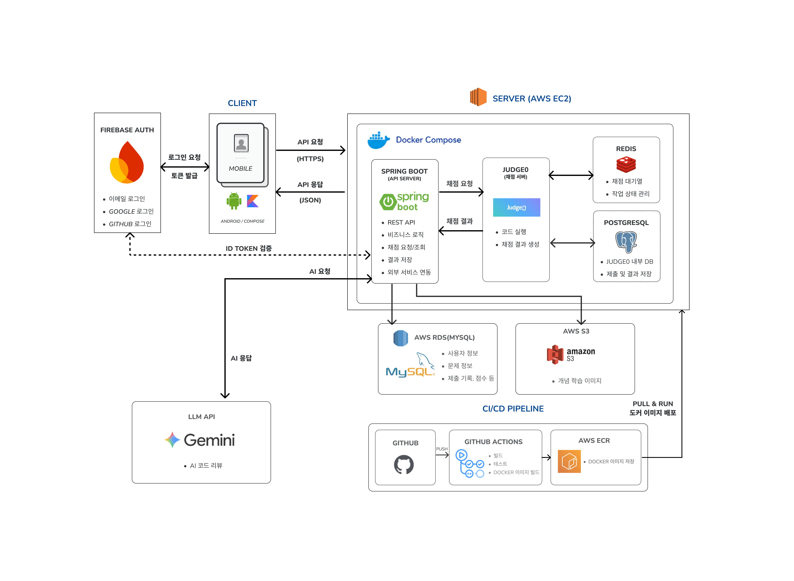

# 프로젝트 소개
PocketCo는 시공간의 제약 없이 스마트폰으로 알고리즘을 학습하는 모바일 안드로이드 애플리케이션입니다. 기존 PC 환경의 한계를 벗어나 언제 어디서든 간편하게 코드를 작성하고 제출할 수 있습니다.  
초보자도 쉽게 학습할 수 있도록 다양한 알고리즘을 '개념-응용-문제'의 3단계 학습 커리큘럼을 통해 제공하며, 코드를 제출하면 AI가 실시간으로 분석하여 최적화 코드와 맞춤형 피드백을 제시해 줍니다.  
또한, 꾸준한 성장을 돕는 직관적인 연속 학습 기록 시스템으로 동기부여 효과를 더했습니다. PocketCo를 활용하여 자투리 시간을 알고리즘 학습 시간으로 만들 수 있습니다.
# 기술 스택 (Back-end)
### 개발 환경
Windows 11, macOS, Amazon EC2
### 개발 도구
IntelliJ IDEA, GitHub, MySQL Workbench, DataGrip, Postman, Swagger
### 개발 언어
Java, SQL
### 주요 기술
Spring Boot, Firebase Auth, MySQL, Amazon RDS, Amazon S3, Amazon ECR, Docker, Docker Compose, GitHub Actions, Judge0 API, Gemini API
# 시스템 아키텍처

# ERD

# 주요 기능
### 사용자 인증 및 관리
- Firebase Auth 기반 회원가입 및 로그인 
- 사용자 프로필 및 마이페이지 조회 
- 사용자 이름, 프로필 이미지 및 언어 설정 관리 
- 사용자별 학습 및 문제 풀이 기록 저장
### 알고리즘 학습 기능
- 알고리즘별 3단계 학습 커리큘럼 제공
- 알고리즘 개념 학습 콘텐츠 제공 
- 구현 코드의 빈칸을 채우는 응용 학습 제공 
- 학습 완료 여부 및 진행 상태 관리 
- 알고리즘별 코딩 문제 조회 지원
### 코딩 문제 풀이 기능
- 알고리즘별 코딩 문제 조회 및 상세 조회 
- 난이도 기반 문제 필터링 및 페이징 조회 
- 모바일 환경 코드 작성 지원 
- 코드 임시 저장 및 불러오기 기능 
- Judge0 API 기반 코드 실행 및 채점 
- 실행 결과 및 채점 결과 반환 
- 문제별 제출 기록 및 최근 제출 기록 조회
### 북마크 기능
- 사용자별 코딩 문제 북마크 추가 및 삭제 
- 사용자별 북마크 목록 조회
### CS 학습 기능
- CS 문제 제공 및 랜덤 문제 조회 
- 정답 및 해설 학습 지원
### AI 코드 리뷰 기능
- Gemini API 기반 AI 코드 리뷰 제공 
- AI 코드 리뷰 요청 및 결과 조회
### 학습 기록 시각화 지원
- 날짜별 문제 풀이 데이터 제공
- GitHub Streak 형태의 학습 현황 시각화를 위한 데이터 지원
- 월별 문제 풀이 개수 및 학습 기록 관리
### 관리자 기능
- 언어 및 알고리즘 데이터 관리 
- 사용자가 사용할 수 있는 공개 프로필 이미지 관리
- 개념 학습 및 응용 학습 콘텐츠 등록 
- 코딩 문제 및 CS 문제 등록 
- Judge0 언어 목록 및 채점 환경 관리 
- 문제별 언어 제한 및 정답 코드 관리
### 서버 및 인프라
- Spring Boot 기반 REST API 서버 구축 
- Docker Compose 기반 개발 및 배포 환경 구성 
- GitHub Actions 기반 CI/CD 자동화 
- Amazon EC2 및 RDS 기반 클라우드 배포
# Swagger/API

# 팀원 역할
### 김완수(okjunges)
Back-end(REST API 개발, DB 설계 및 구축, AI 연동, 서버 구축 및 관리, CI/CD)
### 김하은(rlagkdms11)
Back-end(REST API 개발, DB 설계 및 구축, Firebase Auth 연동)
