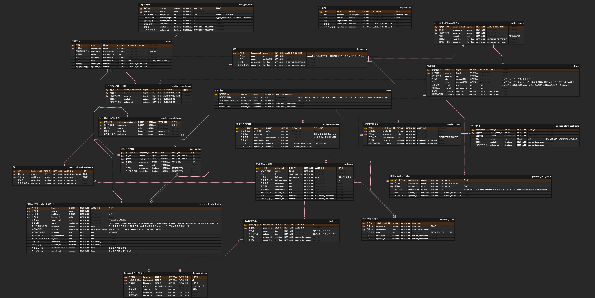
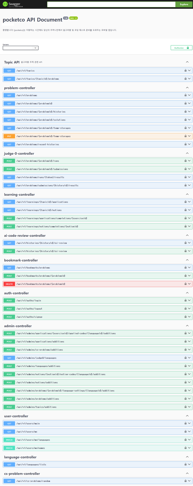

# 프로젝트 소개

# 기술 스택
### 개발 환경
Windows 11, macOS, Amazon EC2
### 개발 도구
IntelliJ IDEA, GitHub, MySQL Workbench, DataGrip, Postman, Swagger
### 개발 언어
Java, SQL
### 주요 기술
Spring Boot, MySQL, Amazon RDS, Amazon S3, Firebase Auth, Judge0 API, Gemini API, Docker Compose, GitHub Actions
# 시스템 아키텍처

# ERD

# 주요 기능
### 사용자 관리
- Firebase Auth 기반 로그인 및 회원 인증
- 사용자 프로필 및 학습 기록 관리
### 알고리즘 학습
- 알고리즘의 개념을 설명해주는 개념 학습
- 알고리즘 구현 코드의 빈칸을 채우는 응용 학습
- 사용자별 학습 완료 기록 관리
### 알고리즘 문제 풀이
- 모바일 환경에서 코드 작성 및 실행
- Judge0 API 기반 코드 실행 환경 제공
- 실행 결과 및 오류 메시지 출력
- 사용자 코드 제출 기록 관리
### CS 학습 기능
- CS 퀴즈 제공
- 정답 및 해설 확인 기능
### AI 기반 코드 리뷰
- Gemini API 기반 사용자가 제출한 코드 리뷰
### 날짜별 학습 관리
- 메인 화면에서 사용자가 문제를 푼 날짜를 시각화
- 날짜별 문제 풀이 기록을 기반으로 연속 학습(Streak) 현황 제공
### 서버 및 인프라
- Docker Compose 기반 서버 환경 구성
- GitHub Actions 기반 CI/CD 자동화
- Amazon EC2 및 RDS 기반 배포 환경 구축
# Swagger/API

# 팀원 역할
### 김완수(okjunges)
Back-end(REST API 개발, DB 설계 및 구축, AI 연동, 서버 구축 및 관리, CI/CD)
### 김하은(rlagkdms11)
Back-end(REST API 개발, DB 설계 및 구축, Firebase Auth 연동)
